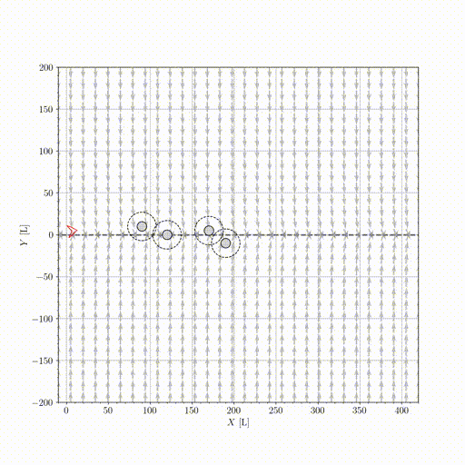

# IK-GVF + C3BF for Path Following with Collision Avoidance



## Related research paper

    @article{jesusbv2024bcf,
      title={Behavioral-based circular formation control for robot swarms},
      author={Bautista, Jesús and de Marina, Héctor García},
      year={2024},
      booktitle={2024 IEEE International Conference on Robotics and Automation (ICRA)}, 
      pages={8989-8995}
    }
    
## Features
This project includes:

* Simulations of the IK-GVF (Inverse Kinematics Guiding Vector Field) for path following.
* Simulations of IK-GVF combined with C3BFs (Collision Cone Control Barrier Functions) for path following with collision avoidance.

## Installation

To install the required dependencies, simply run:

```bash
python install.py
```

### Additional Dependencies
Some additional dependencies, such as LaTeX fonts and FFmpeg, may be required. We recommend following the installation instructions provided in the ```ssl_simulator``` [README](https://github.com/Swarm-Systems-Lab/ssl_simulator/blob/master/README.md). 

To verify that all additional dependencies are correctly installed on Linux, run:
```bash
bash test/test_dep.sh
```

## Usage

Run the Jupyter notebooks inside the `notebooks` directory.

## Credits

If you have any questions, open an issue or reach out to the maintainers:

- **[Jesús Bautista Villar](https://sites.google.com/view/jbautista-research)** (<jesbauti20@gmail.com>) – Main Developer
